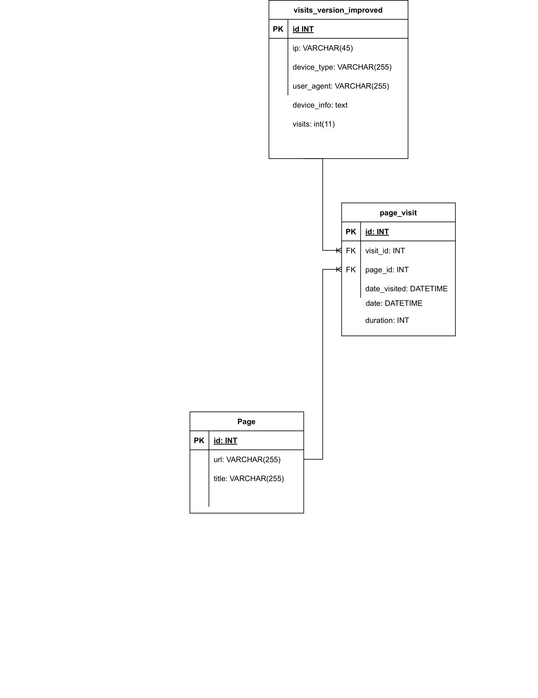

# Website Traffic Tracker

## Description

Website Traffic Tracker is a web application that tracks user visits to web pages. It records the time that each user spends on a web page and stores this data in a MySQL database, including the unique visits per page and the total number of visits per page. The application also provides a dashboard that displays statistics on page visits and time spent on each page, as well as the unique visits per page. Users can filter the dashboard by date range and page title, as well as view detailed information about each visit, such as the device information and the time spent on the page.

## Requirements

### Software used

To run this project, you will need to have the following software installed:

- [Node.js](https://nodejs.org) (version 18.15.0)
- [XAMPP](https://www.apachefriends.org/index.html) or another web server and MySQL database software
- [MySQL](https://www.mysql.com/) (version 8.0.33 or later)

You will also need to create a MySQL database called `traffic_tracker` and import the `traffic_tracker.sql` file located in the `database` directory of the project into the `traffic_tracker` database.

Note: If you are using XAMPP, you can create the `traffic_tracker` database and import the SQL file using the instructions provided in the installation section. If you are using another software, refer to its documentation for instructions on creating a new database and importing an SQL file. Please to not forget to change the connection log in credentials in the db_connection.js if necessary. 

### Database Schema

        -- Create traffic_tracker database
        CREATE DATABASE traffic_tracker;

        -- Use traffic_tracker database
        USE traffic_tracker;

        -- Create page table
        CREATE TABLE page (
        id INT NOT NULL AUTO_INCREMENT,
        url VARCHAR(255) NOT NULL,
        title VARCHAR(255) NOT NULL,
        PRIMARY KEY (id)
        ) ENGINE=InnoDB DEFAULT CHARSET=utf8mb4;

        -- Create visits_version_improved table
        CREATE TABLE visits_version_improved (
        id INT NOT NULL AUTO_INCREMENT,
        ip VARCHAR(45) NOT NULL,
        device_type VARCHAR(255) NOT NULL,
        user_agent VARCHAR(255) NOT NULL,
        device_info TEXT NOT NULL,
        visits INT NOT NULL,
        PRIMARY KEY (id)
        ) ENGINE=InnoDB DEFAULT CHARSET=utf8mb4;

        -- Create page_visit table
        CREATE TABLE page_visit (
        id INT NOT NULL AUTO_INCREMENT,
        visit_id INT NOT NULL,
        page_id INT NOT NULL,
        date_visited TIMESTAMP NOT NULL DEFAULT CURRENT_TIMESTAMP() ON UPDATE CURRENT_TIMESTAMP(),
        duration INT NOT NULL,
        date DATETIME NOT NULL DEFAULT CURRENT_TIMESTAMP(),
        PRIMARY KEY (id),
        KEY visit_id (visit_id),
        KEY page_id (page_id),
        CONSTRAINT page_visit_ibfk_1 FOREIGN KEY (visit_id) REFERENCES visits_version_improved(id),
        CONSTRAINT page_visit_ibfk_2 FOREIGN KEY (page_id) REFERENCES page(id)
        ) ENGINE=InnoDB DEFAULT CHARSET=utf8mb4;

### ERD

### Empty Database SQL

        -- Disable foreign key checks
        SET FOREIGN_KEY_CHECKS = 0;

        -- Drop foreign key constraint in page_visit table
        ALTER TABLE page_visit DROP FOREIGN KEY page_visit_ibfk_2;

        -- Truncate page_visit and page tables
        TRUNCATE TABLE page_visit;
        TRUNCATE TABLE page;

        -- Recreate foreign key constraint in page_visit table
        ALTER TABLE page_visit ADD CONSTRAINT page_visit_ibfk_2 FOREIGN KEY (page_id) REFERENCES page(id);

        -- Enable foreign key checks again
        SET FOREIGN_KEY_CHECKS = 1;

## Installation

### Set up the Client Side
The client tracker is already set up (check up the Client-Tracking folder). In this case, it was build with simple JS to cover all of the browsers. There is also a jquery script, if you do not care about the old browsers.

If you want to add it to another website please follow the following instructions: 

Include the jQuery library in your HTML file

           

Include the traffic_tracker script

           

In the traffic_tracker script, please change the URL for your server

           const serverUrl = 'http://localhost:3000/improvedTracking';

### Server side 

Clone this repository on your local machine

Navigate to the project directory and open a terminal

 To install the dependencies for this project, run the following command in your terminal:

       npm install

This will install all the dependencies listed in the package.json file.

## Usage

### Server Side
Open a terminal in the project folder and type in the following command 

    node app.js

The application should start on your localhost.
Access it on your browser. 

## Dependencies

- [Express](web framework for Node.js)
- [MySQL2](MySQL client for Node.js)
- [UA-parser-js](library for parsing user-agent strings)
- [Cookie-parser](middleware for parsing cookies)
- [Body-parser](middleware for parsing request bodies)

## Development Dependencies

- [Mocha](JavaScript testing framework)
- [Chai] (assertion library for Node.js)
- [Chai-http](HTTP integration testing with Chai assertions)
- [Supertest](library for testing HTTP requests/responses)

## Testing 
This project uses the Mocha testing framework, along with Chai and Sinon for assertions and test doubles. You can run the tests by executing the following command in the project directory in a terminal:

    npm test

The npm test command will execute all the test files located in the test/ directory.
## License

This project is licensed under the ISC License